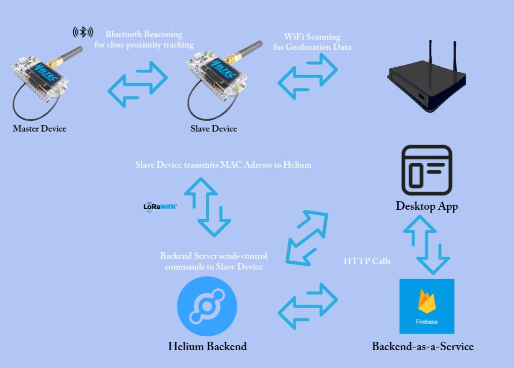

# LoraBLE-locationTracker
34346 Networking Technologies and Application Development for IoT - Group 4

This repository includes all the codes and scripts used for our project.

More information on each part and script can be found within each directory.

## Project Description

The following text is taken from our [one-pager document](./docs/IoT_Project_one_pager____34346.pdf):

> Our objective is to make a local location finder, similarly to the existing AirTags and Tile, to help us find our keys, backpacks or other small items that frequently get lost around the house or larger buildings - almost always during critical times.
> 
> A lot of people don’t have iPhone, making AirTags a non-valid option. AirTags are also expensive and dependent on the mesh that the mass of iPhones in public form. We want to make an alternative, providing the same features non-dependent on the iPhone mesh, instead utilizing modern IoT solutions.
> 
> Our idea is to have one _master device_ that will be used to find the _slave devices_. The master device would be inside a 3D printed casing, including an appropriate MCU, appropriate communication modules, LCD to provide information on connected devices, and few LEDs to indicate the signal strength of how close it is to the searchable object - the slave device. It would also be connected to Wi-Fi in order to get the latest location data from the slave. It will also be BLE enabled to connect to the slave when in close proximity for precision tracking.
> 
> The slave device will be using LoRaWAN for transmitting global geolocation information along with other data regarding the device (BLE status, Battery percentage). The geolocation data will be aquired by scanning for nearby Wi-Fi access points. Forwarding that data to the backend. This information will be used for gathering the more or less precise location of the access point, and thereby the device. This is an alternative to the unavailable LoRaWAN geolocation service, which would have provided a more precise location while using less power. Unfortunately this is not yet available in Denmark.
> 
> Furthermore, the slave will use BLE for precision location while in close proximity. This feature will be enabled on demand via LoRaWAN downlink. Idle mode for the slave will be sleep mode. 
<!--We will use a tilt sensor and an RTC module to wake up the device either on movement or by time.-->

