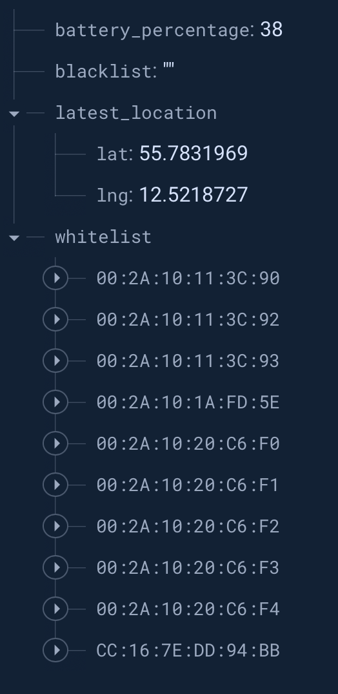

<!--
 * @ Author: Oscar Theilvig Strømsborg
 * @ Create Time: 2024-05-04 15:47:22
 * @ Modified by: Oscar Theilvig Strømsborg
 * @ Modified time: 2024-05-04 16:05:32
 * @ Description:
-->

# LoraBLE-locationTracker
34346 Networking Technologies and Application Development for IoT - Group 4

## Backend

The backend directory contains the code for the backend. It consists of code for two different systems; _Helium_ and _Firebase_.

Both scripts include descriptions and commenting.

### Helium

The directory contains the decoder used to decode the mac addresses, so they have the right format for the HTTP integration.

More about [functions in Helium](https://docs.helium.com/console/functions/).


#### Helium debug results

Results in Helium after integration:

```json
        "decoded": {
          "payload": {
            "batteryPercentage": 100,
            "mac1": "00:2A:10:20:C6:F1",
            "mac2": "00:2A:10:20:C6:F3",
            "mac3": "00:2A:10:20:C6:F0",
            "mac4": "00:2A:10:20:C6:F2",
            "mac5": "00:2A:10:20:C6:F4",
            "mac6": "CC:16:7E:DD:94:B2",
            "mac7": "CC:16:7E:DD:94:B1",
            "mac8": "CC:16:7E:DD:94:B3"
          },
          "status": "success"
```

With information on which hotspot connected to:

```json
        "hotspots": [
          {
            "channel": 1,
            "frequency": 867.3,
            "hold_time": 0,
            "id": "11SrNjCywFSr5A8xje4WeCQsYZZH3CRtki75GseqVaK916A4VrQ",
            "lat": 55.78302691504508,
            "long": 12.514492518478399,
            "name": "fun-marmalade-cobra",
            "reported_at": 1714040994948,
            "rssi": -112,
            "snr": -7.800000190734863,
            "spreading": "SF9BW125",
            "status": "success"
          }
```


### Firebase

The Firebase directory contains the `main.py` file, which was deployed to Firebase functions. This is responsible for making sure the backend handles data appropriately, calling third party API's, handling errors and updating the database etc.


#### Firebase example


