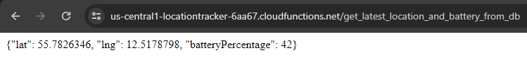

<!--
 * @ Author: Oscar Theilvig Strømsborg
 * @ Create Time: 2024-05-04 15:47:22
 * @ Modified by: Oscar Theilvig Strømsborg
 * @ Modified time: 2024-05-04 16:05:32
 * @ Description:
-->

# LoraBLE-locationTracker
34346 Networking Technologies and Application Development for IoT - Group 4

## Backend

The backend directory contains the code for the backend. It consists of code for two different systems; _Helium_ and _Firebase_.

Both scripts include descriptions and commenting.

### Helium

The directory contains the decoder used to decode the mac addresses, so they have the right format for the HTTP integration.

More about [functions in Helium](https://docs.helium.com/console/functions/).

### Firebase

The Firebase directory contains the `main.py` file, which was deployed to Firebase functions. This is responsible for making sure the backend handles data appropriately, calling third party API's, handling errors and updating the database etc.

