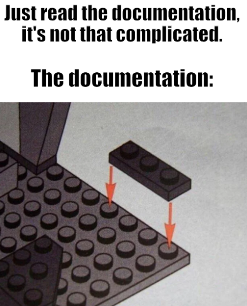

# LoraBLE-locationTracker
34346 Networking Technologies and Application Development for IoT - Group 4

## Documents

This directory includes some of internal notes in the beginning of the project, as well as helpful guides.

### Heltec MCU

Heltec's documentation can be found online: [User Manual and related documents](https://docs.heltec.org/en/node/esp32/wifi_lora_32/index.html)

Including their official library: [HelTecAutomation GitHub Repo](https://github.com/HelTecAutomation/Heltec_ESP32)

_V3.png)
