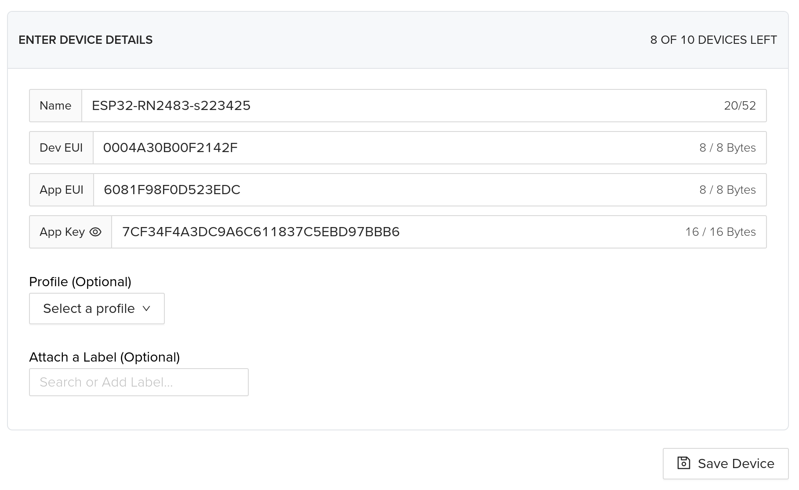
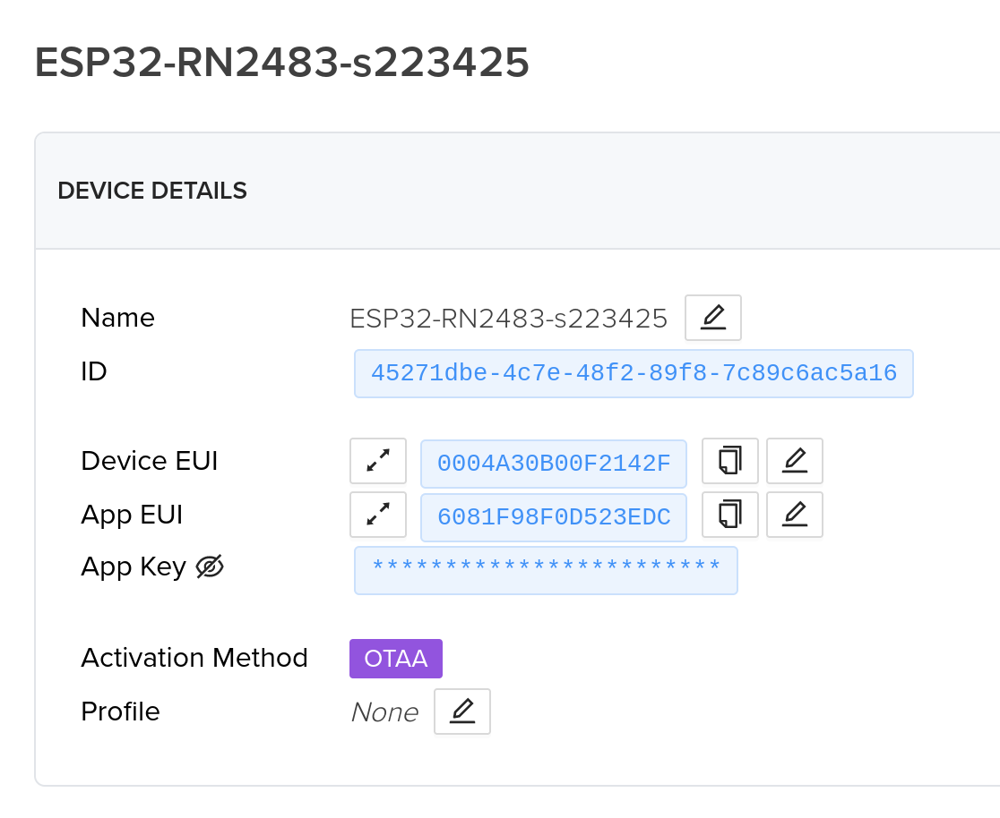

## Software and documents:

- Account on [Helium LoraWAN network](https://console.helium.com/login)
- LoraWAN network coverage. See coverage map [here](https://explorer.helium.com)
- [Microchip RN2483 datasheet](https://ww1.microchip.com/downloads/en/DeviceDoc/50002346C.pdf)
- [Microchip RN2483 command reference user’s guide](https://ww1.microchip.com/downloads/en/DeviceDoc/RN2483-LoRa-Technology-Module-Command-Reference-User-Guide-DS40001784G.pdf)


## Hardware

Temporarily using RN2483 module until using the LoraWAN microcontroller.

| ESP32 | RN2483 |
| --- | --- |
| RX2 | Tx |
| TX2 | Rx |
| D23 | RST |
| 3V3 | 3V3 |
| GND | GND |

Using appropriate jumper wires to connect the two.

## Initial setup

- Add the board manager to `~/.arduino15/arduino-cli.yaml`:

```yaml
board_manager:
additional_urls:
- http://arduino.esp8266.com/stable/package_esp8266com_index.json
- https://raw.githubusercontent.com/espressif/arduino-esp32/gh-pages/package_esp32_index.json
- https://dl.espressif.com/dl/package_esp32_index.json
```

- Add the library `https://github.com/jpmeijers/RN2483-Arduino-Library` using the guide for [arduino-cli](https://arduino.github.io/arduino-cli/1.36/commands/arduino-cli_lib_install/) or [Arduino IDE](https://docs.arduino.cc/software/ide-v1/tutorials/installing-libraries/):

```
$ arduino-cli lib install --git-url https://github.com/jpmeijers/RN2483-Arduino-Library
--git-url and --zip-path flags allow installing untrusted files, use it at your own risk.
Enumerating objects: 45, done.
Counting objects: 100% (45/45), done.
Compressing objects: 100% (41/41), done.
Total 45 (delta 11), reused 17 (delta 1), pack-reused 0
Library installed
```

- Check:

```
$ arduino-cli lib list | grep RN
RN2xx3 Arduino Library  1.0.1       -         LIBRARY_LOCATION_USER -
$ arduino-cli lib examples | grep RN2xx3
Examples for library RN2xx3 Arduino Library
  - /home/snadgh/Arduino/libraries/RN2xx3_Arduino_Library/examples/ArduinoUnoNano-basic
  - /home/snadgh/Arduino/libraries/RN2xx3_Arduino_Library/examples/ArduinoUnoNano-downlink
  - /home/snadgh/Arduino/libraries/RN2xx3_Arduino_Library/examples/ESP8266-RN2483-basic
  - /home/snadgh/Arduino/libraries/RN2xx3_Arduino_Library/examples/SodaqAutonomo-basic
  - /home/snadgh/Arduino/libraries/RN2xx3_Arduino_Library/examples/SodaqOne-TTN-Mapper-ascii
  - /home/snadgh/Arduino/libraries/RN2xx3_Arduino_Library/examples/SodaqOne-TTN-Mapper-binary
  - /home/snadgh/Arduino/libraries/RN2xx3_Arduino_Library/examples/TheThingsUno-basic
  - /home/snadgh/Arduino/libraries/RN2xx3_Arduino_Library/examples/TheThingsUno-GPSshield-TTN-Mapper-binary

```

- Connect the hardware if not done already (*NOTE:* Make sure the antenna is connected before applying voltage to the board) 


## Connecting to Helium

- Use the edited script from lecture 5: `ESP8266-RN2483-basic.ino`

- Attach the board: (*Note:* Might change with the different board)

```
$ arduino-cli board attach -p /dev/ttyUSB0 -b esp32:esp32:esp32doit-devkit-v1 *.ino
Default port set to: /dev/ttyUSB0
Default FQBN set to: esp32:esp32:esp32doit-devkit-v1
```

- Run the code and note down the `DevEUI`:

```
When using OTAA, register this DevEUI: 
0004A30B00F2142F
RN2xx3 firmware version:
RN2483 1.0.5 Oct 31 2018 15:06:52
Trying to join Helium 
```

- Make an account and log into **Helium**: [Helium](https://console.helium.com/login)
- Add a new device: [New Device](https://console.helium.com/devices/new)





```
App EUI: 6081F98F0D523EDC
App key: 7CF34F4A3DC9A6C611837C5EBD97BBB6
```

### Testing the coverage 

```
When using OTAA, register this DevEUI: 
0004A30B00F2142F
RN2xx3 firmware version:
RN2483 1.0.5 Oct 31 2018 15:06:52
Trying to join Helium
Unable to join. Are your keys correct, and do you have Helium coverage?
```


- Next time, try in the covered spot in Lyngby. Classroom not working.


