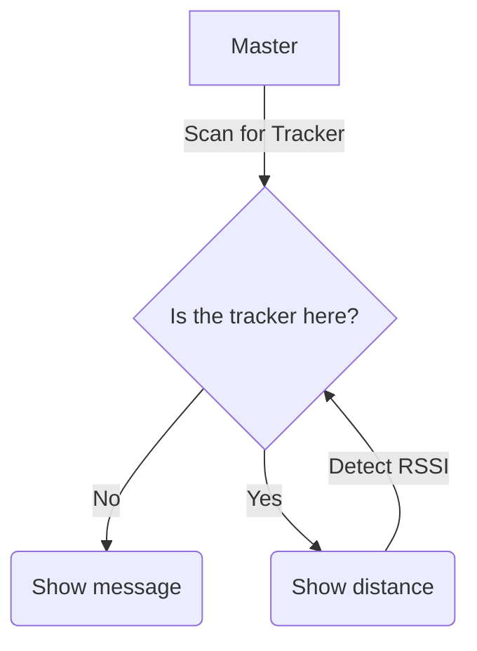

# LoraBLE-locationTracker
34346 Networking Technologies and Application Development for IoT - Group 4

## Scanner iBeacon

The script here is for the _master device_. Its only responsibility is to look for the _slave device_ using BLE, Bluetooth Low Energy, but its UUID is hardcoded at this moment.

