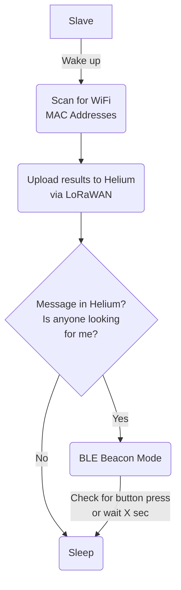

# LoraBLE-locationTracker
34346 Networking Technologies and Application Development for IoT - Group 4

## Slave Device -> Tracker

The slave device is the one attached to something to keep track of. It uses a combination of three functions: LoRAWAN Network Connection, Wi-Fi Mac Addresses scanning, and BLE Beacon. It also shows the status on the OLED display and to extend the battery life: deep sleep.



## Directories shortly explained

| Directory | Usage |
| --- | --- |
| LoRaWAN | A LoRAWAN code, connecting to Helium using a dummy-payload |
| LoRaOLED | The LoRAWAN code, including display of the battery on the OLED |
| macScanner | A code that scans for mac addresses to send as a payload |
| iBeacon | BLE Beacon Mode |
| combined | The combination of all scripts in one |

### iBeacon

This script is how we started broadcasting the beacon mode of the _slave device_, for the _master device_ to find it.

In this script, we specify the frame `0x26`, and the type of the data `0xFF`, but that must comply with the iBeacon protocol data unit (PDU) specification.

We also generated our own UUID using an [online generator](https://www.uuidgenerator.net/). Shorter UUID exists when you propose common services such as heart monitoring in smart-watches, but we have a specific use case, so we must create a new one.                                     

For the company ID, we legally do not have the right to use the manufacturer code of Apple Inc: `0x004c`. Therefore, we decided to use the reserved one `0xFFFF`. It is simply a variable to indicate who is the manufacturer behind the technology.

<!--
From overleaf:

We now specify the length (0x26) of the frame, and the type of data (0xFF)(manufacturer data) that is encompassed in the advertising packet. Those are precise values that must be respected to comply with IBeacon protocol data unit (PDU) specification.

In our case, we used a UUID generator\footnote{\url{https://www.uuidgenerator.net/}} to be sure to use a unique identifier, randomly generated: %e6e9a717-9cc0-4485-8fb1-941f05273c8d. Shorter UUID exists when you propose common services such as Heart Monitoring in smart watches, but we have a specific use case so we must create a new one.

For the company ID, we legally do not have the right to use the manufacturer code of Apple Inc: 0x004c. Therefore we decided to use the reserved one "0xFFFF". It's simply a variable to indicate who is the manufacturer behind the technology.
-->

### LoRaWAN

This script originally comes from the Helium Library example: [LoRaWanOLED.ino](https://github.com/HelTecAutomation/Heltec_ESP32/blob/master/examples/LoRaWAN/LoRaWanOLED/LoRaWanOLED.ino)

That script shows how the user can connect via LoRaWAN network, whilst showing the process on the OLED. We modified the script for our needs, connecting with both _CIBICOM_ (for testing) and _Helium_ network.

In this script we simply send a dummy-payload that was used to test the functions in the Helium backend.

Notes can be found in [docs/loraWAN_notes.md](https://github.com/Snadgh/LoraBLE-locationTracker/blob/master/docs/loraWAN_notes.md).

### LoRaOLED

The script in here is how we continued with the script above, `LoRaWAN.ino`, but adding onto the OLED display but most importantly, the battery functions.

The inspiration we got from an unofficial library: [heltec_unofficial.h](https://github.com/ropg/heltec_esp32_lora_v3/blob/7537d3e081c0bd886951fc82db9cc976d8d79202/src/heltec_unofficial.h#L188C1-L196C2)

### MAC Scanner 

This script is a MAC address scanner, again integrated with the `LoRaWAN.ino` script. The scanner function in this script will scan for nearby Wi-Fi networks, gather their MAC addresses, and send via LoRaWAN network. 

The inspiration we got from a `arduino-esp32` example: [WiFiScan.ino](https://github.com/espressif/arduino-esp32/blob/master/libraries/WiFi/examples/WiFiScan/WiFiScan.ino)

## Example/Log Output in Serial Monitor

```
Setup done
Scan start
Scan done
17 networks found
Nr | SSID            | RSSI | CH | Encryption
 1 | IoTNetwork      |  -62 |  1 | WPA2
 2 | WiFiSSID        |  -62 |  1 | WPA2-EAP
 3 | B3A7992         |  -63 |  6 | WPA+WPA2
 4 | WiFi            |  -63 |  6 | WPA3
 5 | IoTNetwork2     |  -64 | 11 | WPA2+WPA3
...
```
