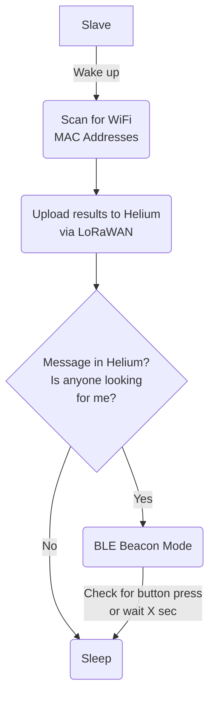

# LoraBLE-locationTracker
34346 Networking Technologies and Application Development for IoT - Group 4

## Slave Device -> Tracker

The slave device is the one attached to something to keep track of. It uses a combination of three functions: LoRAWAN Network Connection, Wi-Fi Mac Addresses scanning, and BLE Beacon. It also shows the status on the OLED display and to extend the battery life: deep sleep.

## Directories shortly explained

| Directory | Usage |
| --- | --- |
| LoRAWAN | A LoRAWAN code, connecting to Helium using a dummy-payload |
| LoRaOLED | The LoRAWAN code, including display of the battery on the OLED |
| macScanner | A code that scans for mac addresses to send as a payload |
| beacon | BLE Beacon Mode |
| combined | The combination of all scripts in one |
