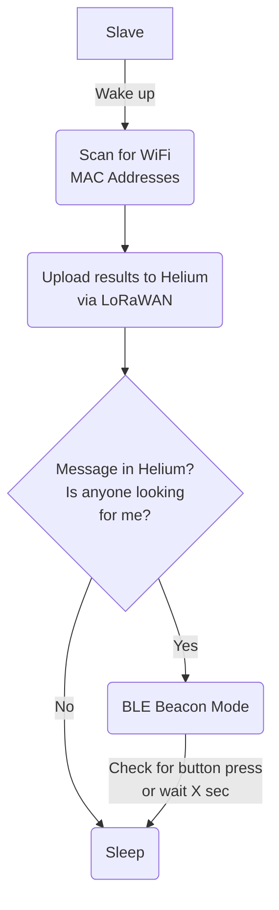

# LoraBLE-locationTracker
34346 Networking Technologies and Application Development for IoT - Group 4

## Slave Device -> Tracker

The slave device is the one attached to something to keep track of. It uses a combination of three functions: LoRAWAN Network Connection, WiFi Mac Addresses scanning, and BLE Beacon. It also shows the status on the OLED display and to extend the battery life: deep sleep.

