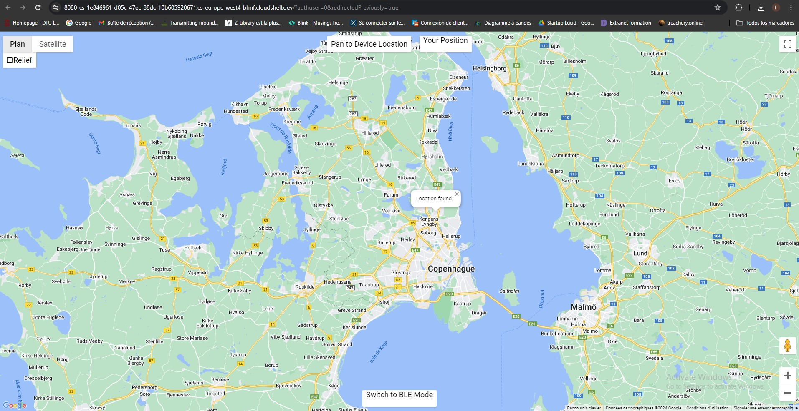

# LoraBLE-locationTracker
34346 Networking Technologies and Application Development for IoT - Group 4

## Web Interface



## User Interface

To start a local server at a specific port, use the terminal, move to project folder and enter: 

```sh
npm start -- --port=8080
```

### CORS problems

Indeed, cors policy does not only specify how the header request should be constructed, but also ask for an explicit authorization to exchange resources between these two specific problems. Your browser automatically checks this, using an "OPTION" type of request. So in our code, we have to also take this into account. This error appears now because this time, we are not receiving data but sending. It was becoming quite technical, so we had no solution but to open Chrome.exe without web security, using the command on the terminal: 

```sh
chrome.exe --disable-web-security --user-data-dir="c:/ChromeDevSession"
```

This works perfectly well but it's not recommended as it allows malicious websites to perform attacks.
